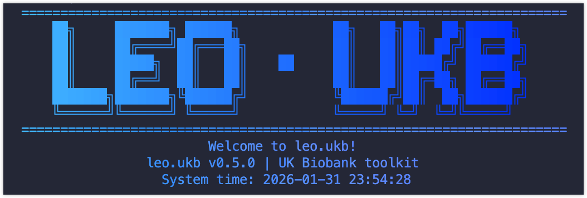

# LEO·UKB 

<!-- badges: start -->
[](https://github.com/laleoarrow/leo.ukb/releases)
[](https://lifecycle.r-lib.org/articles/stages.html#experimental)
[](LICENSE)
[](https://cran.r-project.org/)
<!-- badges: end -->

`leo.ukb` is an internal toolkit for working with UK Biobank (UKB) data. It provides a small set of helper functions that streamline common workflows—field parsing/decoding, format conversion, batch processing, and preparing analysis-ready datasets—for large-scale biomedical studies.

<p align="center">
  
</p>

UK Biobank: https://www.ukbiobank.ac.uk/

## Installation

```r
# Install from GitHub (requires access permission)
remotes::install_github("laleoarrow/leo.ukb")
```

## License

This software is proprietary. All rights reserved. See [LICENSE](LICENSE) for details.
