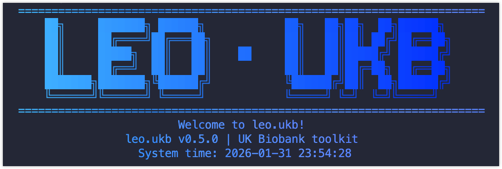

# LEO·UKB 

<!-- badges: start -->
[](https://github.com/laleoarrow/leo.ukb/actions/workflows/pkgdown.yaml)
[](https://github.com/laleoarrow/leo.ukb/releases)
[](https://github.com/laleoarrow/leo.ukb)
[](LICENSE)
[](https://cran.r-project.org/)
<!-- badges: end -->

`leo.ukb` is an internal toolkit for working with UK Biobank (UKB) data. It provides a small set of helper functions that streamline common workflows—field parsing/decoding, format conversion, batch processing, and preparing analysis-ready datasets—for large-scale biomedical studies.

> **Note**: This package is intended for academic research purposes. The code functionalities are experimental and subject to change.

<div align="center">
  
</div>

- [UK Biobank](https://www.ukbiobank.ac.uk/)
- [UKB Showcase](https://biobank.ndph.ox.ac.uk/showcase/)
- [UKB Schema](https://biobank.ndph.ox.ac.uk/showcase/schema.cgi)

## Installation

```r
# Install from GitHub (requires access permission)
remotes::install_github("laleoarrow/leo.ukb")
```

## Documentation

- Tutorial: [Clinical Regression Workflows](https://laleoarrow.github.io/leo.ukb/articles/clinical-regression.html)
- 中文教程: [临床回归分析工作流](https://laleoarrow.github.io/leo.ukb/articles/clinical-regression-zh.html)
- Function reference: [Reference index](https://laleoarrow.github.io/leo.ukb/reference/index.html)

## License

This software is proprietary. All rights reserved. See [LICENSE](LICENSE) for details.

## Authors

Ao Lu. Author, maintainer, copyright holder.

## Citation

Lu A (2026). leo.ukb: LEO package for UK Biobank database analysis. R package version 0.5.1, https://laleoarrow.github.io/leo.ukb/.

```bibtex
@Manual{leo.ukb,
  title = {leo.ukb: LEO package for UK Biobank database analysis},
  author = {Ao Lu},
  year = {2026},
  note = {R package version 0.5.1},
  url = {https://laleoarrow.github.io/leo.ukb/}
}
```
